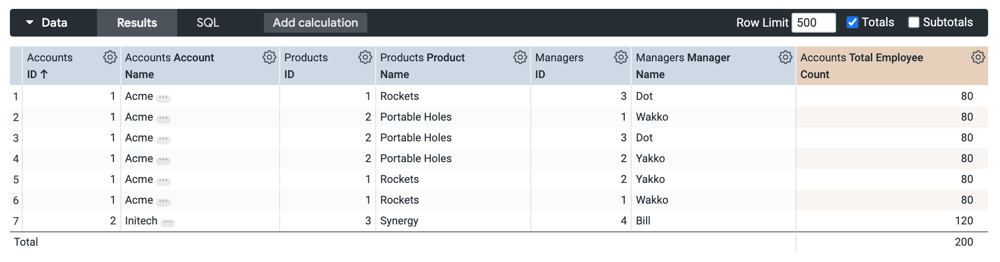
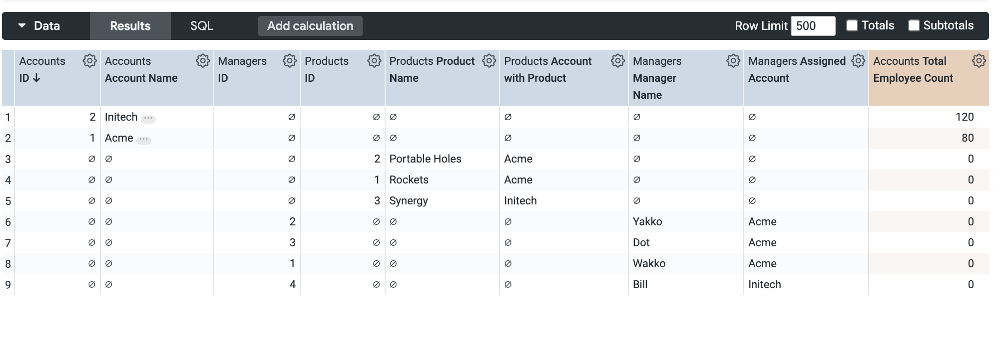
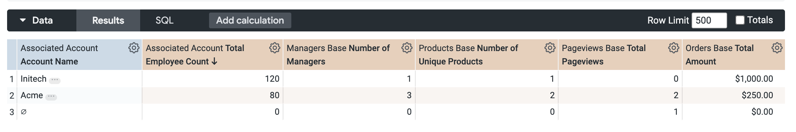

# **Looker Fan-Out Solutions: A Practical Guide**

This LookML project provides a hands-on demonstration of various data modeling techniques to solve the common "fan-out" problem in Looker. The models are based on the excellent strategies outlined in the Google Cloud Community article: [Outer Join on False (or How I learned to stop fanning out and...)](https://www.googlecloudcommunity.com/gc/Modeling/Outer-Join-on-False-or-How-I-learned-to-stop-fanning-out-and/td-p/573726).

-----

## **The Fan-Out Problem**

A "fan-out" occurs when you join a primary table to multiple other tables in one-to-many relationships. This creates a Cartesian product between the joined tables, causing measures from the "one" side of the relationships to be duplicated and incorrectly inflated.

In this project, we have a central `accounts` table. Each account can have multiple `managers` and multiple `products`. When we join all three in a single Explore, our measure for **Total Employees** will be wrong. This project demonstrates how to avoid that.

-----

## **Modeling Approaches**

This project contains three distinct models, each with its own Explore, to illustrate the problem and the solutions.

### **1. The Fan-Out Example (fanout\_example)**

  * **File:** `models/1_fanout_example.model.lkml`
  * **Explore Label:** Fan-Out Example

This model uses simple `LEFT JOINs` to connect `accounts`, `managers`, and `products`. It is designed to **demonstrate the fan-out problem**.


**Specifying the problem:**
The issue arises because the joins create a row for every possible combination of a manager and a product for each account. This inflates the number of rows and leads to incorrect calculations for measures on the `accounts` table.

**To see the issue:**

1.  Open the "Fan-Out Example" Explore.
2.  Select the measure **Total Employees** from the Accounts view.
3.  Add the dimension **Name** from the Managers view.
4.  Add the dimension **Name** from the Products view.

You will notice that the Total Employees value is dramatically inflated in each row. However, thanks to Looker's Symmetric Aggregates, the grand total will be calculated correctly! This feature prevents the fan-out from affecting the final aggregation, but the row-level data can still be misleading.

**Looker-generated SQL:**

```sql
SELECT
....
FROM `demo.accounts`  AS accounts
LEFT JOIN `demo.managers`  AS managers ON accounts.name = managers.account_name
LEFT JOIN `demo.products`  AS products ON accounts.name = products.account_name
GROUP BY
 ...
```
**Explore:**



### **2. The FULL OUTER JOIN ON FALSE Solution (full\_outer\_join\_solution)**

  * **File:** `models/2_full_outer_join.model.lkml`
  * **Explore Label:** Full Outer Join Solution

This model implements the primary technique from the article. By joining the `managers` and `products` views using `type: full_outer` and a false `sql_on: 1=0` condition, we prevent a direct join relationship. This brings the data into the same Explore while allowing Looker's Symmetric Aggregates to function correctly, ensuring that all measures are calculated accurately.

**Specifying the problem:**
This solution directly addresses the fan-out issue from the first example. By using a `FULL OUTER JOIN` with a deliberately false condition, we prevent the database from creating the Cartesian product that was causing the inflated numbers. This allows us to have both `managers` and `products` in the same Explore without them affecting each other's measures.

**To see the solution in action:**

1.  Open the "Full Outer Join Solution" Explore.
2.  Select the measure **Total Employees** from the Accounts view.
3.  Add the dimension **Name** from the Managers view.
4.  Add the dimension **Name** from the Products view.

You'll see that the **Total Employees** value is now correct, regardless of whether you include dimensions from `managers`, `products`, or both. 

**Looker-generated SQL:**

```sql
SELECT
...
FROM `demo.accounts`  AS accounts
FULL OUTER JOIN `demo.managers`  AS managers ON 1=0
FULL OUTER JOIN `demo.products`  AS products ON 1=0
GROUP BY
...
```
**Explore:**



### **3\. The Advanced COALESCE Solution (advanced\_coalesce\_solution)**

* **File:** models/3\_normalized\_schema.model.lkml  
* **Explore Label:** Advanced Coalesce Solution

This is the most robust and flexible pattern, also derived from the article. It builds upon the FULL OUTER JOIN ON FALSE technique. As the article highlights in the "It gets better\!" section, this pattern is incredibly adaptable. We've extended the initial model by adding two new fact tables, pageviews and orders.

1. **Fact Tables (**managers\_base**,** products\_base**,** pageviews\_base**,** orders\_base**)**: We bring in all fact tables using the full\_outer join on a false condition (1=0), giving them unique aliases.  
2. **Dimension Table (**associated\_account**)**: We then LEFT JOIN the accounts view. The sql\_on uses a COALESCE() function that now checks for an account name across all four base tables, intelligently linking the account dimension to any related fact data.

**Specifying the problem**:  
While the FULL OUTER JOIN ON FALSE solution works well, it can become cumbersome to manage if you have many one-to-many relationships. The Advanced COALESCE solution provides a more scalable and organized way to handle these complex scenarios. It creates a "normalized" Explore where each of the "many" tables is joined back to the central "one" table independently.  

**To see the solution in action:**

1. Open the "Advanced Coalesce Solution" Explore.  
2. Select the dimension **Name** from the Associated Account view.  
3. Select measures from the various fact tables, for example:  
   * **Total Employees** from Associated Account  
   * **Distinct Manager Count** from Managers Base  
   * **Distinct Product Count** from Products Base  
   * **Count** from Pageviews Base  
   * **Total Amount** from Orders Base

This pattern creates a clean, reliable Explore where dimensions from the accounts view can be used with measures from any of the joined views without any risk of fanning out. This is the recommended approach for complex models. 

**Looker-generated SQL:**

```sql
WITH pageviews AS (...
      )
  ,  orders AS (...
      LEFT JOIN demo.products AS pr ON o.product = pr.name
)
SELECT
...
FROM `demo.accounts`  AS advanced_coalesce_solution
FULL OUTER JOIN `demo.managers`  AS managers_base ON 1=0
FULL OUTER JOIN `demo.products`  AS products_base ON 1=0
FULL OUTER JOIN pageviews AS pageviews_base ON 1=0
FULL OUTER JOIN orders AS orders_base ON 1=0
LEFT JOIN `demo.accounts`  AS associated_account ON associated_account.name = COALESCE(...)
....
```

**Explore:**


